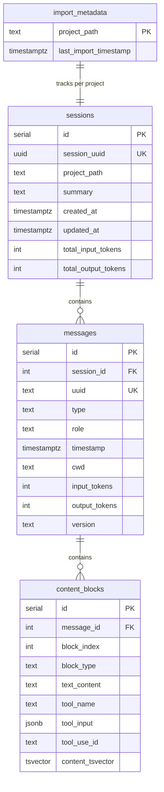

# Database Design

This document describes the PostgreSQL schema for storing and searching Claude Code conversation logs.

## Schema Overview

The database uses four tables to store conversation data:



- **sessions** - One row per Claude Code session
- **messages** - One row per log entry (envelope/metadata)
- **content_blocks** - One row per content block within a message
- **import_metadata** - Tracks last import timestamp per project for idempotent imports

## Why Three Content Tables?

Claude Code logs have a nested structure:
- User messages contain plain text
- Assistant messages contain a **list** of content blocks (text, tool calls, tool results, thinking)

We considered three approaches:

1. **Store content as JSON string** - Simple but not searchable
2. **Extract text only** - Loses tool call/result information
3. **One row per content block** - More rows but fully queryable

We chose option 3 because a key use case is debugging failed conversations. This requires:
- Searching tool results for error messages
- Correlating tool calls with their results
- Finding patterns in what went wrong

## Idempotent Imports

The `import_metadata` table enables safe re-running of imports:

1. Before importing, look up `last_import_timestamp` for the project
2. Skip JSONL entries with timestamps at or before the cutoff
3. A unique partial index on `messages.uuid` provides a safety net against duplicates
4. After successful import, update `last_import_timestamp` to the max timestamp seen

Log entry types are handled as follows:
- `file-history-snapshot` — skipped entirely (no useful content)
- `summary` — captured as metadata on the session, not inserted as a message
- All other types — imported normally, subject to timestamp filtering

## Table Definitions

### sessions

```sql
CREATE TABLE sessions (
    id SERIAL PRIMARY KEY,
    session_uuid UUID UNIQUE NOT NULL,
    project_path TEXT,
    summary TEXT,
    created_at TIMESTAMPTZ DEFAULT CURRENT_TIMESTAMP,
    updated_at TIMESTAMPTZ DEFAULT CURRENT_TIMESTAMP,
    total_input_tokens INT DEFAULT 0,
    total_output_tokens INT DEFAULT 0
);
```

**Purpose**: Groups messages by Claude Code session. Tracks aggregate token usage.

**Fields**:
- `session_uuid` — comes from the log file's `sessionId` field
- `project_path` — derived from the file's location in `~/.claude/projects/`
- `summary` — session title from `summary` log entries (e.g. "CLI Session Ended")

### messages

```sql
CREATE TABLE messages (
    id SERIAL PRIMARY KEY,
    session_id INT NOT NULL REFERENCES sessions(id) ON DELETE CASCADE,
    uuid TEXT,
    type TEXT NOT NULL,
    role TEXT,
    timestamp TIMESTAMPTZ,
    cwd TEXT,
    input_tokens INT,
    output_tokens INT,
    version TEXT
);
```

**Purpose**: Stores the message envelope (metadata) without content.

**Fields**:
- `type` — Log entry type: 'user', 'assistant', 'system'
- `role` — Message role from the API: 'user' or 'assistant'
- `uuid` — Unique identifier from the log entry (unique partial index excludes NULLs)
- `cwd` — Working directory at time of message
- `input_tokens`, `output_tokens` — Token usage for this message
- `version` — Claude Code version

**Notes**:
- Content is stored separately in `content_blocks`
- `CASCADE` delete ensures blocks are removed when a message is deleted

### content_blocks

```sql
CREATE TABLE content_blocks (
    id SERIAL PRIMARY KEY,
    message_id INT NOT NULL REFERENCES messages(id) ON DELETE CASCADE,
    block_index INT NOT NULL,
    block_type TEXT NOT NULL,

    -- Text content (for text, thinking, tool_result blocks)
    text_content TEXT,

    -- Tool use fields
    tool_name TEXT,
    tool_input JSONB,
    tool_use_id TEXT,

    -- Full-text search
    content_tsvector tsvector GENERATED ALWAYS AS (
        to_tsvector('english', COALESCE(text_content, ''))
    ) STORED
);
```

**Purpose**: Stores individual content blocks with type-specific fields.

**Block types**:
- `text` — Text response from Claude (stored in `text_content`)
- `thinking` — Extended thinking block (stored in `text_content`)
- `tool_use` — Tool invocation (stored in `tool_name`, `tool_input`, `tool_use_id`)
- `tool_result` — Tool output (stored in `text_content`, `tool_use_id`)

**Key design decisions**:

1. **`tool_use_id` links calls to results**: Both `tool_use` and `tool_result` blocks store this ID, enabling joins to correlate what was called with what happened.

2. **`tool_input` is JSONB**: Preserves the full input structure and enables JSON queries if needed.

3. **`content_tsvector` is GENERATED STORED**: PostgreSQL automatically maintains the full-text search index when `text_content` changes. "STORED" materializes the vector for faster searches.

### import_metadata

```sql
CREATE TABLE import_metadata (
    project_path TEXT PRIMARY KEY,
    last_import_timestamp TIMESTAMPTZ NOT NULL
);
```

**Purpose**: Tracks the most recent timestamp imported per project, enabling idempotent imports.

**Notes**:
- `project_path` matches the `project_path` stored on sessions
- Updated at the end of each successful import to the max timestamp seen

## Indexes

```sql
-- Message lookups
CREATE INDEX idx_messages_session_id ON messages(session_id);
CREATE INDEX idx_messages_type ON messages(type);
CREATE INDEX idx_messages_timestamp ON messages(timestamp DESC);
CREATE INDEX idx_messages_session_timestamp ON messages(session_id, timestamp DESC);

-- Unique partial index for idempotent imports (excludes NULL uuids)
CREATE UNIQUE INDEX idx_messages_uuid_unique ON messages(uuid) WHERE uuid IS NOT NULL;

-- Content block lookups
CREATE INDEX idx_content_blocks_message_id ON content_blocks(message_id);
CREATE INDEX idx_content_blocks_type ON content_blocks(block_type);
CREATE INDEX idx_content_blocks_tool_use_id ON content_blocks(tool_use_id);
CREATE INDEX idx_content_blocks_tool_name ON content_blocks(tool_name);

-- Full-text search (GIN index for tsvector)
CREATE INDEX idx_content_blocks_fts ON content_blocks USING GIN(content_tsvector);
```

**Why these indexes**:
- `session_id`, `message_id` — Foreign key lookups
- `timestamp DESC` — Recent-first queries
- `uuid` (unique partial) — Prevents duplicate message imports
- `tool_use_id` — Joining tool calls to results
- `tool_name` — Filtering by specific tool
- `GIN(content_tsvector)` — Fast full-text search

## Example Queries

### Find failed tool calls

```sql
SELECT
    m.timestamp,
    s.project_path,
    cb_call.tool_name,
    cb_result.text_content
FROM content_blocks cb_result
JOIN content_blocks cb_call
    ON cb_call.tool_use_id = cb_result.tool_use_id
    AND cb_call.block_type = 'tool_use'
JOIN messages m ON cb_result.message_id = m.id
JOIN sessions s ON m.session_id = s.id
WHERE cb_result.block_type = 'tool_result'
  AND cb_result.content_tsvector @@ to_tsquery('english',
      'error | failed | exception | traceback'
  )
ORDER BY m.timestamp DESC;
```

### Full-text search across all content

```sql
SELECT
    cb.block_type,
    m.timestamp,
    cb.text_content
FROM content_blocks cb
JOIN messages m ON cb.message_id = m.id
WHERE cb.content_tsvector @@ plainto_tsquery('english', 'authentication error')
ORDER BY ts_rank(cb.content_tsvector, plainto_tsquery('english', 'authentication error')) DESC;
```

### Tool usage by project

```sql
SELECT
    s.project_path,
    cb.tool_name,
    COUNT(*) as usage_count
FROM content_blocks cb
JOIN messages m ON cb.message_id = m.id
JOIN sessions s ON m.session_id = s.id
WHERE cb.block_type = 'tool_use'
GROUP BY s.project_path, cb.tool_name
ORDER BY s.project_path, usage_count DESC;
```
